# 绳驱动连续体机器人上位机控制系统设计与实现

## 摘要

**摘要**：本文设计并实现了一套绳驱动连续体机器人（Cable-Driven Continuum Robot）的上位机控制系统。系统基于分段常曲率（Piecewise Constant Curvature, PCC）运动学模型，实现了包含逆运动学求解、串口通信、实时控制及三维可视化在内的完整控制管线。系统采用模块化架构，支持四种控制模式：手动输入、视觉伺服（AprilTag）、预设轨迹跟踪及图像搜索伺服。上位机运行 50Hz 实时控制循环，通过 39 字节定长帧协议与 STM32 下位机通信，控制 8 根腱绳驱动两段连续体机械臂。逆运动学求解采用阻尼最小二乘法（Damped Least Squares）配合多目标惩罚函数优化，兼顾位置精度、运动平滑性和安全约束。通过 MuJoCo 物理引擎实现三维实时渲染，并开发了 tkinter 图形化控制面板。系统在仿真环境中完成了全流程验证，IK 末端定位误差在 1mm 以内，通信帧往返验证无误。此外，利用棋盘格标定工具完成了相机内参标定，为视觉伺服提供基础。

**关键词**：连续体机器人；PCC 运动学；逆运动学；视觉伺服；相机标定；STM32；串口通信

## Abstract

**Abstract**: This paper presents the design and implementation of a host control system for a cable-driven continuum robot. Based on the Piecewise Constant Curvature (PCC) kinematic model, the system implements a complete control pipeline including inverse kinematics solving, serial communication, real-time control, and 3D visualization. The system adopts a modular architecture supporting four control modes: manual input, visual servoing (AprilTag), predefined trajectory tracking, and image-based search servoing. The host runs a 50Hz real-time control loop and communicates with the STM32 microcontroller via a 39-byte fixed-length frame protocol, controlling 8 tendons to drive a two-segment continuum manipulator. Inverse kinematics is solved using the Damped Least Squares method with multi-objective penalty function optimization, balancing position accuracy, motion smoothness, and safety constraints. 3D real-time rendering is achieved through the MuJoCo physics engine, and a tkinter graphical control panel is developed. The system has been fully validated in simulation environments, with IK end-effector positioning error within 1mm and error-free communication frame round-trip verification. Camera intrinsic parameters are calibrated using a chessboard pattern tool, providing a foundation for vision-based servoing.

**Keywords**: Continuum Robot; PCC Kinematics; Inverse Kinematics; Visual Servoing; Camera Calibration; STM32; Serial Communication

---

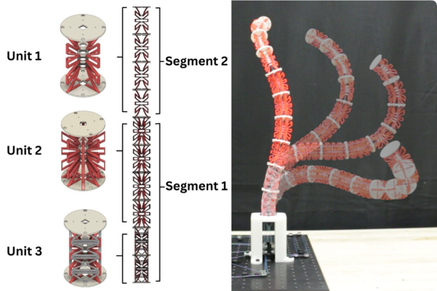

**图 1：预期实物效果图** — 本机器人设计阶段的目标效果图（截自参考文献[11]），展示了机器人完成状态下的外观预期。

---

# 1 项目简介与个人任务概述

## 1.1 项目背景

连续体机器人（Continuum Robot）是近年来机器人领域的研究热点之一。与传统刚性关节机器人不同，连续体机器人的结构类似于象鼻、章鱼触手或蛇类，通过连续柔性弯曲实现运动，具有高灵活性和在受限空间内操作的能力。绳驱动连续体机器人（Cable-Driven Continuum Robot）通过多根腱绳的协调收放来控制机器人的弯曲方向和角度，是连续体机器人的重要分支。

本课题来源于"机器人结构设计"课程，要求以小组为单位，完整经历从概念设计到实物验证的机器人开发全流程。本项目设计并实现了一款绳驱动连续体机器人，涵盖机械结构设计、3D 打印制造与装配、运动学与动力学仿真、上位机控制系统开发以及下位机 STM32 嵌入式控制的全链路工作。

## 1.2 项目内容概述

本项目的总体目标是设计并实现一套完整的绳驱动连续体机器人系统，主要工作包括以下方面：在**机械结构设计**方面，基于 PCC 运动学模型确定机器人几何参数（两段式结构，第一段 6 子节、第二段 4 子节），完成了柔性骨架、腱绳导向与驱动座等零部件的三维模型设计；在**加工制造与装配**方面，使用 3D 打印技术完成结构件的快速原型制造，进行了零部件装配与腱绳穿引，实现了机器人本体的机械组装与调试；在**运动学与动力学仿真**方面，建立了 PCC 运动学模型，在 MuJoCo 物理引擎中进行运动学与动力学仿真，验证了机器人构型设计的合理性；在**上位机控制**方面，基于 Python 开发了 50Hz 实时控制循环，实现了用户交互、运动学解算、串口通信、三维可视化等功能；在**下位机嵌入式系统**方面，基于 STM32F407 开发了 UART 帧解析、仿真的 1kHz PID 位置伺服控制和编码器反馈模拟功能；在**通信协议**方面，设计了 39 字节定长帧协议（含 CRC16-Modbus 校验），实现了上下位机之间的可靠数据交换；在**相机标定**方面，开发了基于棋盘格的标定工具，获取了相机的内参矩阵和畸变系数，为视觉伺服提供硬件基础。（注：机械设计阶段规划了 8 路绳驱动架构，因时间限制实物样机最终以 6 绳配置实现，文中统一以设计规格 8 路展开，在结尾处说明妥协细节。）

## 1.3 个人任务概述

本人在本项目中的工作贯穿上位机控制系统的需求分析、架构设计、编码实现与系统联调全过程，具体任务如下。

**在视觉伺服方面**，基于 AprilTag 实现了两种视觉伺服模式：眼在手外模式下，通过单目相机检测 AprilTag 并利用 solvePnP 解算 6-DOF 位姿，经坐标变换后驱动 IK 实现末端跟踪；眼在手上模式下，实现了纯像素偏差驱动的图像伺服算法，包含螺旋扫描搜索、目标锁定（死区+滞回）和自动跟踪的完整闭环。

**在运动学建模与求解方面**，运动学模型（PCC 正/逆运动学）的推导与实现由组内其他同学完成，本人在此基础上进行了实际应用相关的修改与完善，包括：建立**坐标系与绳子的关联**（将绳分布方位角 $\phi$ 与机器人基坐标系对齐，确保运动学模型与物理绳路一致）；添加**安全约束**（弯曲角硬限幅 `clamp_theta`、软约束惩罚函数）；实现**多目标优化框架**（将最小位移正则化、弯曲角惩罚、绳长惩罚集成到 IK 求解器的线搜索中，在保证精度的同时提高求解鲁棒性）。深入参与了机械设计参数的讨论，确保 PCC 模型参数（分段长度、绳分布半径、子节数）与物理样机一致。

**在通信协议设计方面**，设计并实现了基于 UART 的 39 字节定长帧协议，包括 CRC16-Modbus 校验、帧解析状态机和多线程收发架构。后期完善阶段增加了 ACK 超时检测、串口写超时保护和发送器急停模式等故障安全机制。

**在控制系统实现方面**，编写了 50Hz 主控制循环、绳长运动插值器（RotationInterpolator）、GUI 与主循环的数据桥接（SharedState）等核心控制逻辑。

**在 GUI 控制面板方面**，基于 tkinter 实现了图形化控制面板，支持四种控制模式的切换与实时状态显示，状态指示项包含 FPS、ACK 状态、编码器状态、IK 误差等。

**在仿真与测试方面**，编写了下位机模拟器及全流程仿真测试脚本，完成了运动学精度验证和系统联调。

**在相机标定方面**，实现了基于棋盘格的内参标定工具，包括图像采集与角点检测、标定求解与参数保存，并将标定结果集成到视觉伺服管线中。

## 1.4 报告结构安排

本文共分十章。第二章为引言，介绍相关研究背景与机器人机械结构设计；第三章介绍系统总体设计，包括软硬件架构和模块划分；第四章详细介绍 PCC 运动学模型的推导与实现，包括正/逆运动学和腱绳耦合映射；第五章介绍相机标定的原理与工具实现；第六章详述通信协议设计，包括帧格式、CRC 校验和多线程收发；第七章说明输入源与控制模式的详细实现；第八章说明上位机软件的实现细节，重点展示从底层到完整的六阶段迭代开发历程；第九章展示实验验证与结果分析；第十章进行结论与展望。

---

# 2 引言

## 2.1 国内外研究现状

### 2.1.1 连续体机器人运动学建模

在连续体机器人运动学建模方面，Webster III 和 Jones（2010）[1] 提出的分段常曲率（PCC）假设是目前最广泛采用的模型框架。该假设将连续体离散为若干常曲率弧段，每个弧段由弯曲角 $\theta$ 和弯曲平面角 $\phi$ 描述，并将运动学统一分解为"驱动器空间→构型空间"和"构型空间→任务空间"两个独立映射，为后续研究奠定了标准化建模基础。Jones 和 Walker（2006）[8] 进一步将 PCC 模型推广到多段连续体机器人，推导了多段串联的正运动学与微分运动学。

然而，经典 PCC 模型假设常曲率圆弧，在变曲率或大变形场景下精度有限。刘宇航等（2026）[12] 提出了一种解析模型与数据驱动结合的建模方法，以 PCC 模型为基础，利用高斯过程回归（GPR）通过少量实验数据对末端位姿进行修正，同时采用线性变曲率（LVC）模型求解整体构型，在保证高计算效率的同时大幅提升了构型预测精度。

杨明星等（2026）[10] 针对绳驱连续体机器人的驱动误差问题，分析了绳孔接触特性并提出了一种驱动误差补偿策略，有效降低了末端位置误差。

### 2.1.2 连续体机器人结构设计

在结构设计方面，Dewi 等（2024）[11] 针对肌腱驱动连续体机器人刚度不足的问题，提出了一种可 3D 打印的轻量化模块化脊柱设计，通过改变柔性机构的单元排列实现预编程的刚度调节，在减轻重量的同时提升了刚度。**本文机器人的机械结构设计直接基于该工作实现**，采用相同的模块化单元组合思路设计了三种刚度单元（Unit 1/2/3），通过不同的翼片数量和内部填充实现根部刚、末端柔的刚度梯度分布。

张声（2025）[13] 针对绳驱蛇形机器人的复杂非线性动力学建模与控制难题，采用拉格朗日法建立了精确的动力学模型，设计了非奇异快速终端滑模控制器（NFTSMC），并引入非线性干扰观测器（NDOB）补偿系统干扰，通过仿真与样机实验验证了算法的鲁棒性。

### 2.1.3 控制架构与视觉伺服

在控制架构方面，当前连续体机器人系统普遍采用"上位机+下位机"的分层架构。上位机负责高层规划与运动学计算，下位机负责底层伺服控制。通信方式以串口（UART）、CAN 总线或 EtherCAT 为主，其中串口以其实现简单和通用性强的特点在小规模教学与科研平台中广泛使用。

在视觉伺服方面，AprilTag 系统（Olson, 2011）[2] 因其计算效率高、检测鲁棒性强而被大量应用于机器人定位与跟踪。结合 PnP（Perspective-n-Point）算法可从单帧图像恢复目标的 6-DOF 位姿。Camarillo 等（2009）[9] 研究了耦合腱驱动连续体机器人的构型跟踪问题，为本文的腱绳耦合建模提供了理论参考。

### 2.1.4 知识空白与本文定位

综上所述，当前研究在 PCC 运动学建模、结构设计优化和控制策略方面已取得丰富成果，但将完整的运动学求解、实时控制、多模式交互和三维可视化集成于统一平台的系统级实现仍较少见。本文旨在填补这一空白，设计并实现一套涵盖上述功能的绳驱动连续体机器人上位机控制系统。

## 2.2 机器人机械结构设计

本节根据小组初期阶段的机械设计方案，对本机器人的机械结构进行详细说明。该设计紧密围绕"结构刚度分布"、"绳索驱动路径"和"工程可复现性"三大核心展开，是后续运动学建模和控制算法能够有效作用于物理样机的基础。

### 2.2.1 总体机械架构与参数

机器人采用**两段式串联**结构，整体设计轻量化且紧凑。样机总质量仅 **78.8 g**，总长度 **615.6 mm**，主体直径 **40 mm**。共包含 **10 个模块化单元**（两段式分布，第一段 6 单元、第二段 4 单元），参考了"轻量模块化 + 可预编程刚度"的设计思路。驱动方式采用**肌腱驱动（绳驱）**，设计为 **8 根驱动绳**（每段 4 根，90° 圆周均匀分布），通过在截面圆周上等角度分布实现对两段柔顺结构的独立弯曲控制。（注：因时间限制，实物样机最终改为 6 绳配置——第一段 4 根、第二段 2 根，下文以 8 路设计为准展开描述。）

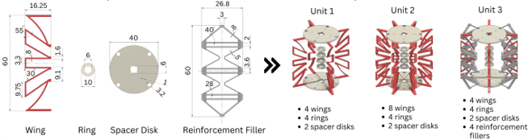

**图 2-1：三种模块化刚度单元的设计图** — 本机器人的模块化刚度设计基于四类基础零部件装配而成，通过更换组合方式实现三种不同刚度的功能单元。

**基础零部件**（左侧）：Wing（翼片）——红色锯齿状结构，是机构的主体支撑和活动关节部分；Ring（圆环）——小型圆形连接环，用于加固节点；Spacer Disk（间隔圆盘）——大型圆盘，中心有方孔（穿过主轴），周围均匀分布 4 个圆孔，起定位和承载作用；Reinforcement Filler（加强填料）——Z 字形波纹管结构，具有弹性和高轴向承载力，用于内部填充。

**三种装配变体**（右侧）：Unit 1（4 翼片 + 4 圆环 + 2 间隔盘）——基础对称骨架结构；Unit 2（8 翼片 + 4 圆环 + 2 间隔盘）——翼片数量加倍，形成更密集阵列，刚度更高；Unit 3（4 翼片 + 2 间隔盘 + 4 加强填料）——去掉圆环，在内部插入加强填料，大幅提升抗压/抗扭性能。三种单元通过同一套中心方轴和螺栓的装配逻辑实现功能迥异的结构形态，体现了"轻量模块化 + 可预编程刚度"的设计思路。

### 2.2.2 核心结构创新：预设刚度分布

这是机械结构最核心的设计亮点，旨在解决"柔性结构承载刚度不足"的矛盾。在连续体机器人中，单纯追求柔性会导致末端负载能力极低，而过度加强刚度又会丧失柔顺性。本设计通过几何单元的差异实现"根部刚、末端柔"的刚度梯度布局。

**三类刚度单元**：设计了 Unit 1、Unit 2、Unit 3 三种单元，它们**保持相同的外径（40 mm）**，但内部几何结构（筋板宽度、镂空形状）不同，从而实现**刚度逐级提升**。**柔顺旋转铰链**：单元间通过柔顺旋转铰链连接，提供大角度弯曲能力，同时避免传统刚性铰链的间隙和摩擦问题。**布局策略**：在高弯矩区域（如根部）放置更高刚度的单元以增强承载能力，而在末端保留较低刚度的单元以维持柔顺性和环境适应性。

### 2.2.3 驱动绳路与传动几何

机械结构与运动学模型的耦合体现在绳路的精确布置上。第一段由 4 根绳独立驱动（90° 圆周分布），对侧绳长差形成该段的弯曲角（$\theta_1$），平均绳长对应中心线长度。第二段同样由 4 根绳独立驱动（90° 圆周分布），控制第二段的弯曲角（$\theta_2$）和弯曲平面角（$\phi_2$）。（注：实物样机因时间限制，第二段最终仅保留了 0° 和 180° 两个方位的拮抗对，$\phi_2$ 失去独立控制能力。）绳路在截面上的分布半径 $r$ 直接决定了绳长变化量与弯曲角度的映射关系：$\Delta l = r \cdot \theta \cdot \cos\phi$。装配时必须保证绳路、张紧、舵机零位和模型参数一致，否则算法输出的圈数无法转化为实际末端运动。8 根绳最终汇聚连接至舵机绳盘，舵机旋转圈数通过绳盘直径 $D$ 换算为直线绳长变化量：$\Delta L = \pi D \cdot N$。

### 2.2.4 张紧装置

张紧装置是本机器人机械系统的重要组成部分，它不是附属件，而是控制系统能够正常工作的**机械前提**。其功能定位是补偿绳索初始松弛、调节预紧力，并在换线或重新装配后恢复一致零位。设计时需综合考虑 4 个关键机械约束：**调节行程**（满足绳索因蠕变或温度变化产生的长度微调需求）、**固定方式**（保证在振动和拉力下不滑移）、**可拆装性**（便于更换磨损的腱绳）和**相对位置**（必须精确对齐舵机绳盘，确保绳路走向顺畅，避免额外摩擦和偏载）。只有绳路稳定、张力可调、零点可复现，上位机计算的 8 路圈数才能转化为可信的末端运动。

### 2.2.5 执行器与动力单元

舵机系统设计为 **8 路独立舵机** 分别驱动 8 根绳（实物样机因时间限制改为 6 路），由 STM32 通过 PCA9685 模块输出 PWM 波控制。舵机以 **135° 定义为中位角**，程序内对每圈角度进行限幅，确保舵机工作在线性且安全的行程范围内，降低腱线拉断或机构损坏风险。

### 2.2.6 材料选择与结构校核

机械强度的有限元校核通过 Abaqus 完成，对机械强度提供量化支撑。主体采用 **PLA 材料**（3D 打印常用），材料参数为：弹性模量 **E=3500 MPa**、泊松比 **$\nu$=0.35**、许用应力 **60 MPa**。在预压缩（装配压紧）基准状态下，叠加 **1 N 至 10 N** 的横向集中载荷。校核结论为：**5 N 载荷**下最大 Mises 应力为 **18.266 MPa**，安全系数（SF）为 **3.285**，满足工程保守要求（参考线 SF=3）；**10 N 载荷**下最大 Mises 应力为 **36.535 MPa**（未超 60 MPa 许用应力），但安全系数已低于参考线，工程余量不足。该结果直接指导机械使用边界：**建议将 5 N 附近作为保守工作载荷参考**，超出范围需进行结构优化或材料替换。

### 2.2.7 装配集成与机械精度要求

装配质量直接影响 PCC 模型参数（如分段长度、弯曲半径）、绳长零位和控制输出的可信度。集成计划要求记录绳路走线、舵机零位、绳盘直径、张紧行程和预紧状态作为实物基准。后续的回零、轨迹跟踪实验必须基于这一套统一的机械状态进行。

---

# 3 系统总体设计

## 3.1 系统架构

本系统采用经典的上位机-下位机分层架构。

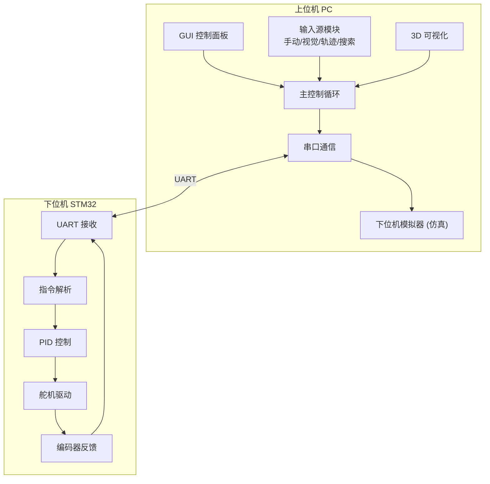
```mermaid
graph TB
    subgraph 上位机 PC
        A["GUI 控制面板"] --> B["主控制循环"]
        C["输入源模块<br/>手动/视觉/轨迹/搜索"] --> B
        D["3D 可视化"] --> B
        B --> E["串口通信"]
        E --> F["下位机模拟器 (仿真)"]
    end
    
    subgraph 下位机 STM32
        G["UART 接收"] --> H["指令解析"]
        H --> I["PID 控制"]
        I --> J["舵机驱动"]
        J --> K["编码器反馈"]
        K --> G
    end
    
    E <-->|UART| G
```

**图 3-1：系统总体架构图**

### 3.1.1 上位机（PC 端）

上位机运行 Python 3，负责高层控制逻辑，包括 50Hz 定周期运行的**主控制循环**（输入读取、运动学计算、插值步进和通信更新）、**PCC 正/逆运动学求解器**、**四种可切换的输入源**、**100Hz 串口发送与接收通信层**、**MuJoCo 3D 与 OpenCV 可视化**以及 **tkinter 图形化控制面板**。

### 3.1.2 下位机（STM32 端）

下位机运行在 STM32F407 微控制器上。本人实现了其**通信协议解析部分**（UART 帧接收与命令解析、CRC 校验、ACK 回复）以及**仿真模式下的 PID 控制模拟器**（fake_stm32.py）。实际硬件层面的舵机 PWM 驱动、编码器读取和 PID 位置伺服控制由组内其他同学完成。仿真模式下，上位机通过虚拟串口与模拟器通信，可实现无硬件的全流程调试。

### 3.1.3 仿真模式

系统支持无硬件仿真运行。通过虚拟串口对（如 com0com），上位机连接 COM13，模拟器连接 COM14，在 PC 上完整模拟下位机行为。

## 3.2 软件模块划分

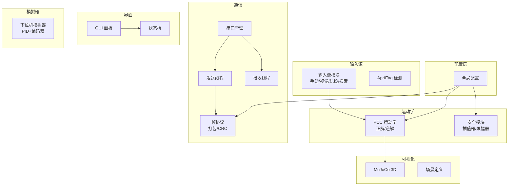
```mermaid
graph TD
    subgraph 配置层
        CF[全局配置]
    end
    
    subgraph 运动学
        KE[PCC 运动学<br/>正解/逆解]
        SF[安全模块<br/>插值器/限幅器]
    end
    
    subgraph 通信
        PR[帧协议<br/>打包/CRC]
        SM[串口管理]
        SD[发送线程]
        RV[接收线程]
    end
    
    subgraph 输入源
        IS[输入源模块<br/>手动/视觉/轨迹/搜索]
        VT[AprilTag 检测]
    end
    
    subgraph 界面
        GUI[GUI 面板]
        SS[状态桥]
    end
    
    subgraph 可视化
        MV[MuJoCo 3D]
        MM[场景定义]
    end
    
    subgraph 模拟器
        FK[下位机模拟器<br/>PID+编码器]
    end
    
    CF --> KE
    CF --> SF
    CF --> PR
    IS --> KE
    KE --> MV
    SD --> PR
    SM --> SD
    SM --> RV
    GUI --> SS
```

**图 3-2：软件模块依赖关系图**

各模块职责如下：**配置层**（config.py）集中管理串口、协议、机器人几何、控制频率等所有可调参数，被运动学、通信等模块引用。**运动学模块**（`robot/kinematics.py`）提供 PCC 正/逆运动学求解和腱绳耦合映射；安全模块（`robot/safety.py`）提供弯曲角限幅和运动插值器。**通信模块**分四层：协议层（`comm/protocol.py`）定义帧打包/解析和 CRC 校验；串口管理层（`comm/serial_mgr.py`）封装线程安全的串口读写；发送和接收线程（`comm/sender.py`、`comm/receiver.py`）分别以 100Hz 和异步方式工作。**输入源模块**通过统一接口提供四种控制模式的输入。**GUI 模块**通过 SharedState 状态桥与主循环解耦通信。**可视化模块**实时渲染 MuJoCo 3D 场景。**模拟器**（`sim/fake_stm32.py`）作为独立进程运行，模拟下位机 PID 控制和编码器反馈。

## 3.3 数据流设计

系统的核心数据流跨越三个抽象空间：任务空间（Task Space）、构型空间（Config Space）和驱动空间（Actuation Space），如图所示。

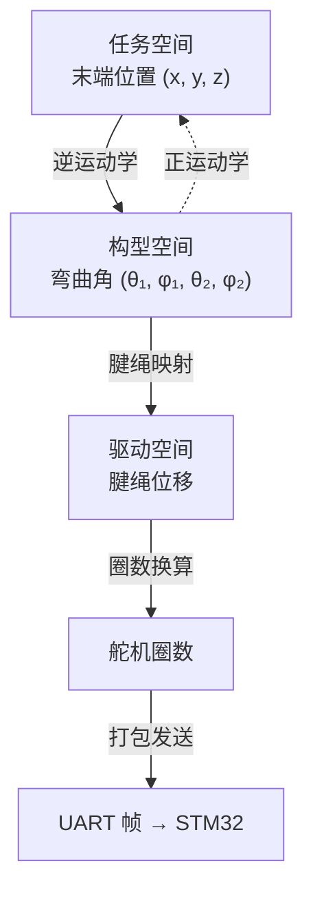
```mermaid
graph TB
    TS["任务空间<br/>末端位置 (x, y, z)"] -->|逆运动学| CS["构型空间<br/>弯曲角 (θ₁, φ₁, θ₂, φ₂)"]
    CS -->|腱绳映射| AS["驱动空间<br/>腱绳位移"]
    AS -->|圈数换算| AC["舵机圈数"]
    AC -->|打包发送| UART["UART 帧 → STM32"]
    CS -.->|正运动学| TS
```

**图 3-3：三空间数据流图**

系统的数据流跨越三个抽象空间：**任务空间**（Task Space）以末端位置坐标 $(x, y, z)$ 表示目标，是用户和视觉模块直接交互的接口；**构型空间**（Config Space）以弯曲角 $(\theta_1, \phi_1, \theta_2, \phi_2)$ 描述机器人骨架变形状态；**驱动空间**（Actuation Space）以舵机圈数 $R_1 \text{--} R_8$ 表示实际执行器的输出。正向数据流从任务空间经逆运动学（IK）到构型空间、经腱绳映射到驱动空间、经圈数换算打包为 UART 帧发送至下位机。逆向路径（驱动空间→构型空间→任务空间）用于仿真验证，通过 tendon_to_config 逆映射和正运动学（FK）计算执行结果。

## 3.4 线程模型

系统采用多线程并发架构。仿真模式下，下位机模拟器作为独立进程运行，其内部包含 PID 和反馈发送线程，通过虚拟串口与主控制程序通信。

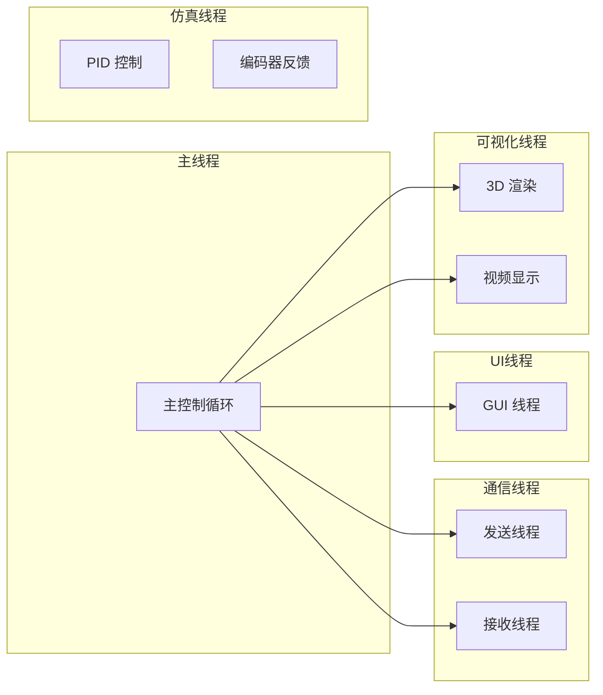
```mermaid
graph LR
    subgraph 主线程
        ML[主控制循环]
    end
    
    subgraph 通信线程
        ST[发送线程]
        RT[接收线程]
    end
    
    subgraph UI线程
        GT[GUI 线程]
    end
    
    subgraph 可视化线程
        MT[3D 渲染]
        OT[视频显示]
    end
    
    subgraph 仿真线程
        PT[PID 控制]
        FT[编码器反馈]
    end
    
    ML --> ST
    ML --> RT
    ML --> GT
    ML --> MT
    ML --> OT
```

**图 3-4：系统线程架构图**

系统采用多线程并发架构，各线程职责如下：**主线程**运行 50Hz 主控制循环，负责任务调度、运动学计算和状态更新。**通信线程**包含两个独立线程——发送线程以 100Hz 定频发送舵机指令，接收线程以异步方式持续读取串口缓冲区并解析反馈帧，二者通过共享缓冲区与主线程交换数据。**GUI 线程**以 10Hz 刷新率通过 SharedState 与主线程交换数据，避免直接共享内存。**可视化线程**包括 MuJoCo 3D 渲染（约 17Hz）和 OpenCV 视频显示（30Hz）。仿真模式下，**模拟器进程**独立运行，内部包含 PID 控制线程（1kHz）和编码器反馈发送线程（20Hz），通过虚拟串口与主程序通信。

---

# 4 运动学建模与求解

本章详细介绍两段式绳驱动连续体机器人的运动学模型。与刚性关节机器人不同，连续体机器人通过连续柔性变形实现运动，其运动学建模需要采用基于分段常曲率（PCC）假设的几何方法。本章从单段 PCC 模型出发，逐步推导正运动学、逆运动学、腱绳耦合映射以及安全约束实现的全过程。

## 4.1 分段常曲率（PCC）建模原理

### 4.1.1 从刚性关节到连续体

传统刚性关节机器人的每个关节由一个旋转或平移自由度描述，关节间的几何关系通过 Denavit-Hartenberg（D-H）参数法建模。连续体机器人则不同——其骨架可以连续弯曲，理论上具有无穷自由度。PCC 假设将这一连续变形离散化为有限段常曲率圆弧的串联：每段圆弧用两个参数描述——弯曲角 $\theta$（弯曲程度）和弯曲平面角 $\phi$（弯曲方向），即配置空间坐标 $[\theta, \phi]^\text{T}$。

### 4.1.2 本机器人的配置空间

本机器人采用两段式结构，每段的 PCC 参数为：

- 第一段（共 $n=6$ 个相同子节）：$q_1 = [\theta_1, \phi_1]^\text{T}$，控制整体弯曲方向和角度
- 第二段（共 $m=4$ 个相同子节）：$q_2 = [\theta_2, \phi_2]^\text{T}$，控制末端弯曲方向和角度

因此系统的配置空间为 4 维向量 $q = [\theta_1, \phi_1, \theta_2, \phi_2]^\text{T}$。

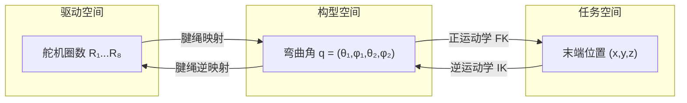
```mermaid
graph LR
    subgraph 驱动空间
        R["舵机圈数 R₁...R₈"]
    end
    
    subgraph 构型空间
        Q["弯曲角 q = (θ₁,φ₁,θ₂,φ₂)"]
    end
    
    subgraph 任务空间
        P["末端位置 (x,y,z)"]
    end
    
    R -->|"腱绳映射"| Q
    Q -->|"正运动学 FK"| P
    P -->|"逆运动学 IK"| Q
    Q -->|"腱绳逆映射"| R
```

## 4.2 正运动学（Forward Kinematics）

正运动学解决"已知配置参数 $q$，求末端位置 $\mathbf{p} = [x, y, z]^\text{T}$"的问题。对于 PCC 模型，这等价于将每段常曲率圆弧的齐次变换矩阵串联起来。

### 4.2.1 单段 PCC 的几何与变换矩阵

考虑一段长度为 $L$、曲率半径为 $\rho$ 的常曲率圆弧。该圆弧位于弯曲平面 $\phi$ 内弯曲了角度 $\theta$，满足 $\rho = L/\theta$。圆弧末端在弯曲平面内的坐标为：

$$
\begin{aligned}
p_x' &= \rho(1 - \cos\theta) = \frac{L}{\theta}(1 - \cos\theta) \\
p_z' &= \rho\sin\theta = \frac{L}{\theta}\sin\theta
\end{aligned}
$$

将弯曲平面旋转到方位角 $\phi$，得到末端在三维空间中的位置：

$$
\begin{aligned}
p_x &= \rho(1 - \cos\theta)\cos\phi = \frac{L}{\theta}(1 - \cos\theta)\cos\phi \\
p_y &= \rho(1 - \cos\theta)\sin\phi = \frac{L}{\theta}(1 - \cos\theta)\sin\phi \\
p_z &= \rho\sin\theta = \frac{L}{\theta}\sin\theta
\end{aligned}
$$

末端的姿态（旋转矩阵）由三次旋转构成：先绕 $z$ 轴旋转 $\phi$ 对齐弯曲平面，再绕新 $y$ 轴旋转 $\theta$ 实现弯曲，最后绕新 $z$ 轴旋转 $-\phi$ 回到原始坐标系：

$$
R = \mathrm{R}_z(\phi) \cdot \mathrm{R}_y(\theta) \cdot \mathrm{R}_z(-\phi)
$$

组合为 $4 \times 4$ 齐次变换矩阵：

$$
T =
\begin{bmatrix}
R & \mathbf{p} \\
\mathbf{0}^\text{T} & 1
\end{bmatrix}
$$

当 $\theta = 0$（未弯曲）时，变换退化为沿 $z$ 轴平移 $L$ 的特殊情况。上述计算过程可描述为：

```
算法：单段 PCC 正运动学变换矩阵
─────────────────────────────────────────────
输入：段长 L, 弯曲角 θ, 弯曲平面角 φ
输出：4×4 齐次变换矩阵 T

if |θ| ≈ 0:
    返回纯平移矩阵: z 方向平移 L
else:
    ρ ← L / θ                              // 曲率半径
    p_x ← ρ · (1 - cosθ) · cosφ            // 末端 x 坐标
    p_y ← ρ · (1 - cosθ) · sinφ            // 末端 y 坐标
    p_z ← ρ · sinθ                          // 末端 z 坐标
    R ← Rz(φ) · Ry(θ) · Rz(-φ)             // 旋转矩阵
    返回 T = [[R, p], [0, 1]]
```

### 4.2.2 多段串联

本机器人的两段各由多个相同子节串联而成。第一段有 $n=6$ 个子节，每节参数为 $[\theta_1, \phi_1]$；第二段有 $m=4$ 个子节，每节参数为 $[\theta_2, \phi_2]$。整体变换矩阵为：

$$
T_{\text{total}} = \underbrace{T_1 \cdot T_1 \cdot \ldots \cdot T_1}_{n \text{ 次}} \cdot \underbrace{T_2 \cdot T_2 \cdot \ldots \cdot T_2}_{m \text{ 次}}
$$

其中 $T_1$ 和 $T_2$ 分别为第一段和第二段的单子节变换矩阵。末端位置即为 $T_{\text{total}}$ 的平移向量部分。计算过程可描述为：

```
算法：多段 PCC 串联正运动学
─────────────────────────────────────────────
输入：θ₁, φ₁, θ₂, φ₂, 子节数 n, m
输出：末端位置 p = [x, y, z]

T ← I₄                              // 初始化为单位矩阵
T₁ ← 单段变换(θ₁, φ₁)               // 第一段单子节变换
循环 n 次:                           // 第一段 n 次串联
    T ← T · T₁
T₂ ← 单段变换(θ₂, φ₂)               // 第二段单子节变换
循环 m 次:                           // 第二段 m 次串联
    T ← T · T₂
返回 T 的平移向量部分
```

### 4.2.3 数值雅可比矩阵

微分运动学建立了关节速度与末端速度之间的线性映射，由雅可比矩阵 $J \in \mathbb{R}^{3 \times 4}$ 表示：$\dot{\mathbf{p}} = J(q) \dot{q}$。本文采用数值差分法计算雅可比，对每个配置参数施加微小扰动 $h$ 并观察末端位置变化：

$$
J_{ij} = \frac{\partial p_i}{\partial q_j} \approx \frac{p_i(q + h \cdot e_j) - p_i(q)}{h}
$$

对应的数值计算过程为：

```
算法：数值雅可比矩阵
─────────────────────────────────────────────
输入：当前配置 q = [θ₁, φ₁, θ₂, φ₂], 步长 h
输出：3×4 雅可比矩阵 J

p₀ ← FK(q)                                  // 计算当前位置
for j = 1 to 4:                             // 对每维配置参数
    q' ← q, q'[j] ← q'[j] + h               // 施加微小扰动
    p' ← FK(q')                              // 计算扰动后位置
    J[:, j] ← (p' - p₀) / h                  // 有限差分
返回 J
```

## 4.3 逆运动学（Inverse Kinematics）

逆运动学解决"已知目标末端位置 $\mathbf{p}_{\text{target}}$，求配置参数 $q$"的问题，是控制管线的核心环节。

### 4.3.1 问题特性

本系统的逆运动学具有两个关键特性：一是**超定性**——任务空间有 3 个自由度（位置 $x, y, z$），而配置空间有 4 个维度（$\theta_1, \phi_1, \theta_2, \phi_2$），这是一个冗余系统，存在无穷多解；二是**非线性**——正运动学是三角函数的复杂组合，无法解析求逆，需要数值迭代求解。

### 4.3.2 阻尼最小二乘法（Damped Least Squares）

采用阻尼最小二乘法（也称为 Levenberg-Marquardt 方法）求解 IK。在每个迭代步中，将当前末端位置 $\mathbf{p}(q)$ 与目标的误差 $\mathbf{e} = \mathbf{p}_{\text{target}} - \mathbf{p}(q)$ 通过雅可比映射到配置空间，同时引入阻尼项 $\lambda$ 抑制过大步长：

$$
dq = (J^\text{T}J + \lambda I)^{-1} J^\text{T} \mathbf{e}
$$

其中 $\lambda$ 是阻尼系数（默认 $\lambda = 10^{-3}$），起到以下作用：当雅可比接近奇异时保证矩阵可逆，限制步长防止发散，并自动在精度与稳定性之间平衡。

### 4.3.3 多目标优化框架

单纯的末端位置跟踪不足以满足实际控制需求。本文在 IK 求解器中集成了更完整的优化框架，总代价函数包含四项：

$$
\begin{aligned}
\mathcal{C}(q) = &\underbrace{\|\mathbf{p}_{\text{target}} - \mathbf{p}(q)\|^2}_{\text{位置误差}} \\
&+ w_{\text{disp}} \underbrace{\|\mathbf{g}(q)\|^2}_{\text{最小位移}} \\
&+ \underbrace{P_\theta(q)}_{\text{弯曲角惩罚}} + \underbrace{P_{\text{cable}}(q)}_{\text{绳长惩罚}}
\end{aligned}
$$

正规方程扩展为：

$$
dq = (J^\text{T}J + w_{\text{disp}} J_{\text{tendon}}^\text{T} J_{\text{tendon}} + \lambda I)^{-1} (J^\text{T} \mathbf{e} + dq_{\text{penalty}})
$$

其中 $J_{\text{tendon}}$ 是腱绳映射的雅可比矩阵，$dq_{\text{penalty}}$ 是软约束惩罚的梯度（将在 4.5 节详述）。线搜索采用回溯策略：从 $\alpha=1.0$ 开始尝试，若新解的总代价未降低则将 $\alpha$ 减半，最多回溯 5 次。

### 4.3.4 迭代收敛与验收

迭代终止条件为位置误差 $\|\mathbf{e}\|$ 小于容差（默认 $\text{tol}=10^{-4}$ m）。迭代结束后，通过正运动学验证 IK 解算质量：若 $\|\mathbf{p}_{\text{target}} - \text{FK}(q_{\text{IK}})\| > \text{验收容差}$（默认 $2 \times 10^{-3}$ m），则拒绝该解。迭代流程可概括为：

```
算法：阻尼最小二乘逆运动学求解
─────────────────────────────────────────────
输入：目标位置 p_target, 初始猜测 q₀ (可选)
输出：配置参数 q, 舵机圈数 rotations

if q₀ 为空: q ← 初始猜测(10°, 0°, 10°, 0°)
else: q ← q₀

循环至多 max_iter 次:
    e ← p_target - FK(q)                    // 末端位置误差
    if ‖e‖ < tol: 终止循环
    J ← 数值雅可比(q)                        // 3×4 雅可比
    dq ← 求解正规方程 (JᵀJ + λI)⁻¹Jᵀe       // DLS 步长
    dq ← dq + 惩罚梯度(q, J)                 // 软约束梯度

    // 线搜索回溯
    for α = 1.0, 0.5, 0.25, 0.125, 0.0625:
        q_try ← q + α · dq
        夹紧 θ₁, θ₂ 到 [-θ_max, θ_max]
        if 总代价(q_try) < 总代价(q):
            q ← q_try, 接受该步
            break

q ← clamp_theta(q)                          // 最终限幅
tendons ← 腱绳映射(q)                        // 配置→驱动空间
rotations ← -tendons / (π · D)               // 圈数换算

if ‖p_target - FK(q)‖ > 验收容差:
    返回 None (拒绝该解)
返回 rotations, q
```

## 4.4 腱绳耦合映射

### 4.4.1 单段腱绳位移

对于第一段（4 绳、90° 圆周分布），绳方位角分别为 $0^\circ, 90^\circ, 180^\circ, 270^\circ$，在弯曲角 $\theta$、弯曲平面角 $\phi$ 下的腱绳位移为：

$$
\begin{aligned}
\Delta l_1 &= -r\theta\cos\phi \quad (0^\circ) \\
\Delta l_2 &= r\theta\sin\phi \quad (90^\circ) \\
\Delta l_3 &= r\theta\cos\phi \quad (180^\circ) \\
\Delta l_4 &= -r\theta\sin\phi \quad (270^\circ)
\end{aligned}
$$

其中 $r$ 为绳分布半径。对侧绳长差 $\Delta l_1 - \Delta l_3 = 2r\theta\cos\phi$ 等信息与弯曲角 $\theta$ 线性相关。第二段有相同的 4 绳配置（$0^\circ, 90^\circ, 180^\circ, 270^\circ$），对应 $\Delta l_5 \text{--} \Delta l_8$ 的计算公式与第一段相同。（注：实物样机因时间限制，第二段最终仅保留了 $0^\circ$ 和 $180^\circ$ 两个方位的拮抗对，即 $\Delta l_5 = -r\theta_2\cos\phi_2$, $\Delta l_6 = r\theta_2\cos\phi_2$。）

### 4.4.2 第二段耦合项

第二段的腱绳需要穿过第一段的所有子节才能到达末端锚点。因此，第二段腱绳的总位移包含两部分：第二段自身弯曲产生的位移（记为 $\Delta l_{\text{sec2}}$）加上第一段 n 个子节在相同方位产生的耦合位移（$\Delta l_{\text{sec1}} \cdot n$）。准确建模这一耦合是保证驱动空间与构型空间映射一致性的关键。计算过程为：

```
算法：完整腱绳耦合映射
─────────────────────────────────────────────
输入：配置参数 θ₁, φ₁, θ₂, φ₂
输出：所有腱绳的总位移 [Δl₁ ... Δl₈]

// 第一段：4 绳，每子节位移 × 子节数
Δl₁₋₄ ← 单段腱绳位移(θ₁, φ₁, 4绳) × n

// 第二段：4 绳，每子节位移 × 子节数
Δl₅₋₈_自身 ← 单段腱绳位移(θ₂, φ₂, 4绳) × m
// 叠加第一段 n 节在对应方位的耦合位移
Δl₅₋₈ ← Δl₅₋₈_自身 + 耦合位移(Δl₁₋₄, n)

返回 [Δl₁, Δl₂, Δl₃, Δl₄, Δl₅, Δl₆, Δl₇, Δl₈]
```

### 4.4.3 驱动空间逆映射

在仿真验证中，需要将舵机圈数（驱动空间）转换回配置空间，以通过 FK 获得实际末端位置。该逆映射使用与 IK 相同的阻尼最小二乘框架：以当前腱绳位移与目标腱绳位移的误差为优化目标，求解最接近的配置参数 $q$。该映射在模拟器闭环验证中起到了关键作用——使仿真环境能够从舵机圈数反推出机器人实际构型，进而通过 FK 计算末端位置，实现控制管线的端到端精度验证。

### 4.4.4 圈数换算

腱绳位移（米）与实际舵机圈数之间通过绳盘直径 $D$ 换算：

$$
N_i = -\frac{\Delta l_i}{\pi D}
$$

负号源于符号约定：PCC 文献中 $\Delta l > 0$ 表示绳伸长，而舵机正转对应收紧（缩短）。

## 4.5 安全约束与惩罚函数

### 4.5.1 弯曲角硬限幅

`clamp_theta(q)` 是最基础的安全函数，在每次 IK 迭代后强制执行，将 $\theta_1$ 和 $\theta_2$ 限制在 $[-\theta_{\max}, \theta_{\max}]$ 范围内（默认 $\theta_{\max}=30^\circ$），确保任何情况下都不会产生超出机械结构允许范围的弯曲角度。

### 4.5.2 弯曲角软约束惩罚

硬限幅会导致求解器在边界附近反复震荡。为此引入软约束惩罚，当弯曲角超过软边界（最大角的 80%）时激活：

$$
P_{\theta} = \sum_{i} w_{\theta} \cdot \max(0, |\theta_i| - \theta_{\text{soft}})^2
$$

梯度：
$$
\nabla_{\theta_i} P_{\theta} = 2 w_{\theta} \cdot \max(0, |\theta_i| - \theta_{\text{soft}}) \cdot \operatorname{sign}(\theta_i)
$$

### 4.5.3 腱绳长度限制

实际舵机驱动的绳盘存在物理行程上限。当某根腱绳的圈数超过软限制（5 圈）时激活惩罚：

$$
P_{\text{cable}} = \sum_{i} w_{\text{cable}} \cdot \max(0, |r_i| - r_{\text{soft}})^2
$$

梯度通过腱绳雅可比投影到构型空间：
$$
\nabla_q P_{\text{cable}} = -\frac{w_{\text{cable}}}{\pi D} \cdot \mathbf{J}_{\text{tendon}}^\text{T} \cdot \nabla_r P_{\text{cable}}
$$

### 4.5.4 最小位移正则化

为防止无谓的腱绳张紧和松弛，始终激活最小位移正则化项，偏好腱绳位移较小的解：

$$
P_{\text{disp}} = w_{\text{disp}} \cdot \|\mathbf{g}(q)\|^2
$$

梯度：
$$
\nabla_q P_{\text{disp}} = 2 w_{\text{disp}} \cdot \mathbf{J}_{\text{tendon}}^\text{T} \cdot \mathbf{g}(q)
$$

### 4.5.5 运动插值器（RotationInterpolator）

运动插值器是控制管线中唯一的平滑层，独立于运动学求解模块运行，以固定步长逐步逼近目标值。它维护当前实际位置 `current` 和目标位置 `target` 两个向量。每次步进时，对每根舵机分别计算差值 $\delta_i$：若 $|\delta_i|$ 小于单步最大变化量（默认 0.01 圈）则直接到达，否则按最大步长逼近。该机制有效避免了舵机指令突变引起的冲击和震荡。插值器还支持通过编码器反馈同步实际位置（`sync_current`），防止累计误差导致偏移；急停时调用 `reset` 将 current 和 target 锁定为当前值，确保急停后不会发生意外跳动。

---

# 5 相机标定

视觉伺服模式依赖相机提供目标物体的位姿信息，而相机内参的准确性直接决定了 solvePnP 位姿解算的精度。本章介绍基于棋盘格的相机标定原理、工具实现与标定结果。

## 5.1 标定原理

### 5.1.1 针孔相机模型

针孔相机模型描述了三维空间点 $\mathbf{P} = [X, Y, Z]^\text{T}$ 到二维图像点 $\mathbf{p} = [u, v]^\text{T}$ 的投影过程：

$$
s \begin{bmatrix} u \\ v \\ 1 \end{bmatrix} = K \cdot [R | t] \cdot \begin{bmatrix} X \\ Y \\ Z \\ 1 \end{bmatrix}
$$

其中 $s$ 为尺度因子，$[R|t]$ 为相机外参（旋转和平移），$K$ 为相机内参矩阵：

$$
K = \begin{bmatrix}
f_x & 0 & c_x \\
0 & f_y & c_y \\
0 & 0 & 1
\end{bmatrix}
$$

其中 $f_x, f_y$ 为焦距（像素单位），$[c_x, c_y]^\text{T}$ 为光心坐标。

### 5.1.2 畸变模型

实际镜头存在光学畸变，主要包括径向畸变（由透镜形状引起，图像边缘尤为明显）和切向畸变（由透镜与成像平面不平行引起）。OpenCV 采用以下多项式模型描述畸变：

**径向畸变**：
$$
\begin{aligned}
x_{\text{corrected}} &= x(1 + k_1 r^2 + k_2 r^4 + k_3 r^6) \\
y_{\text{corrected}} &= y(1 + k_1 r^2 + k_2 r^4 + k_3 r^6)
\end{aligned}
$$

**切向畸变**：
$$
\begin{aligned}
x_{\text{corrected}} &= x + [2p_1 xy + p_2(r^2 + 2x^2)] \\
y_{\text{corrected}} &= y + [p_1(r^2 + 2y^2) + 2p_2 xy]
\end{aligned}
$$

其中 $r^2 = x^2 + y^2$，$(x, y)$ 为归一化平面坐标。本系统使用 5 个畸变系数 $[k_1, k_2, p_1, p_2, k_3]$。

### 5.1.3 张正友标定法

张正友标定法[14]是目前最广泛使用的相机标定方法。其核心思想是利用平面棋盘格在多个不同位姿下的图像，通过平面单应性约束求解相机内参。该方法只需要一个打印的棋盘格模板，操作简便且精度满足大多数应用需求。标定流程如下：

1. 在不同方向、距离和角度下采集棋盘格图像（>20 张）
2. 对每张图像检测棋盘格角点（亚像素精度）
3. 利用角点在世界坐标系中的已知坐标与图像坐标的对应关系，求解单应性矩阵
4. 通过多个单应性矩阵的约束求解内参初值
5. 使用非线性最小二乘精化所有参数（内参、畸变系数、外参）
6. 通过重投影误差评估标定质量

## 5.2 标定工具实现

本系统的相机标定工具位于 `tools/camera_calibration_tool/`，由两个组件构成。

### 5.2.1 图像采集工具

图像采集工具用于采集棋盘格标定照片。它打开摄像头并实时显示画面，用户按下 **Space 键**拍照保存至 `chess/` 目录，按下 **ESC 键**退出。工具会根据已有照片自动编号，并实时显示当前照片计数。拍照时要求棋盘格出现在视野的不同位置和角度——靠近边缘、倾斜、旋转、远近结合——以确保标定覆盖整个视场。采集界面会叠加显示当前采集计数以提高效率。

### 5.2.2 标定求解工具

标定求解工具是标定的核心模块，使用 OpenCV 函数实现完整标定管线。标定流程为：

1. **角点检测**：对每张图像检测棋盘格角点（使用 OpenCV 的 findChessboardCorners 函数），再通过亚像素精化提升角点定位精度（cornerSubPix 函数）
2. **标定求解**：调用 OpenCV 的 calibrateCamera 求解内参和外参。该函数基于张正友标定法，自动处理多张图像的约束
3. **参数优化**：通过 getOptimalNewCameraMatrix 获取去畸变后的最优相机矩阵
4. **结果保存**：将内参矩阵、去畸变矩阵、畸变系数和有效区域（ROI）保存为 XML 文件 `camera_params.xml`

### 5.2.3 畸变校正

标定完成后，可以使用标定结果对图像或视频进行畸变校正。校准器提供单帧校正方法、实时摄像头校正以及视频文件校正功能。校正流程为：先通过 OpenCV 的 undistort 去畸变，再根据 ROI 裁剪掉边缘失真区域，最后缩放到原始分辨率。

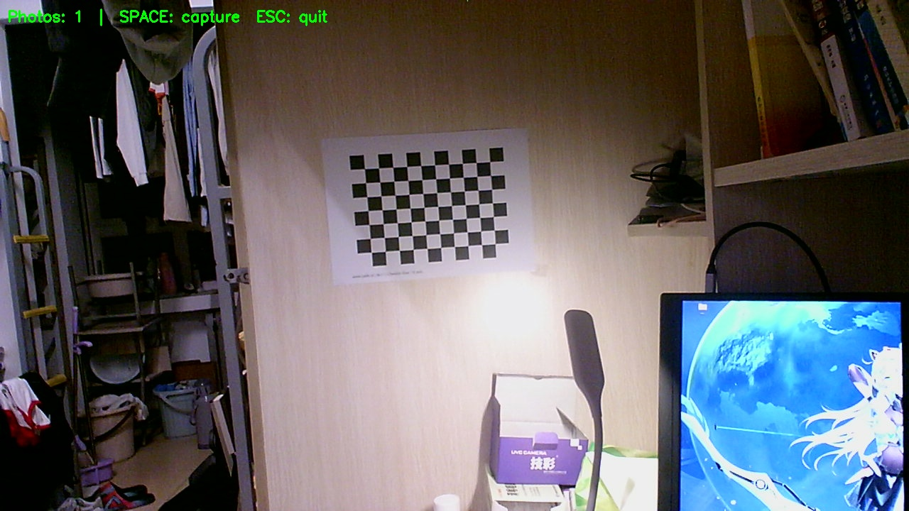

**图 5-1：棋盘格标定示例** — 图中是一张用于标定的棋盘格照片，棋盘格被放置在摄像头前不同位姿下拍摄。软件检测棋盘格内角点（图中圆圈标记），通过多张照片的角点对应关系求解相机内参。

## 5.3 标定结果

通过 `camera_calibration_tool` 对本项目使用的 USB 摄像头进行标定，结果保存于 `tools/camera_calibration_tool/camera_params.xml`。标定图像尺寸为 $1280 \times 720$，棋盘格尺寸为 8×6 角点，方格边长 25 mm。

**内参矩阵**：
$$
K = \begin{bmatrix}
979.93 & 0 & 691.12 \\
0 & 977.94 & 380.65 \\
0 & 0 & 1
\end{bmatrix}
$$

**畸变系数**：
$$
[k_1, k_2, p_1, p_2, k_3] = [0.2507, -0.8146, 0.0027, 0.0023, 0.9756]
$$

**去畸变后最优矩阵**：
$$
K_{\text{new}} = \begin{bmatrix}
1012.82 & 0 & 690.97 \\
0 & 998.10 & 381.19 \\
0 & 0 & 1
\end{bmatrix}
$$

**有效区域（ROI）**：$[x=14, y=12, w=1260, h=695]$

标定结果显示，$f_x$ 和 $f_y$ 基本一致（差异约 0.2%），说明相机传感器像素接近正方形；光心 $(c_x, c_y)$ 接近图像中心 $(640, 360)$，符合预期。畸变系数 $k_3 = 0.9756$ 较大，表明该摄像头在边缘区域有较明显的径向畸变，因此畸变校正是必要的。

## 5.4 视觉伺服管线集成

标定得到的内参矩阵和畸变系数被直接用于视觉伺服管线中的 AprilTag 位姿估计。在 `vision/tracker.py` 中，调用 `cv.solvePnP()` 时传入标定结果，从单帧图像中恢复 tag 的 6-DOF 位姿。随后经过相机-机器人坐标变换（当前为单位矩阵，待后续手眼标定），得到机器人坐标系下的目标位置，送入逆运动学求解器。

### 5.4.1 未标定项与展望

当前相机-机器人坐标变换 $[R_{\text{cam}\to\text{robot}} \mid t_{\text{cam}\to\text{robot}}]$ 为单位矩阵，意味着假设相机坐标系与机器人基坐标系完全对齐。实际部署中这不成立，需要后续完成手眼标定以获得准确的变换关系。

---

# 6 通信协议设计

## 6.1 帧格式定义

上位机与 STM32 下位机之间通过 UART（115200 baud）通信，采用 39 字节定长帧格式：

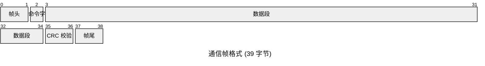
```mermaid
packet-beta
title 通信帧格式 (39 字节)

0-1: "帧头"
2: "命令字"
3-34: "数据段"
35-36: "CRC 校验"
37-38: "帧尾"
```

**图 6-1：通信帧格式（39 字节定长）**

| 偏移 | 长度 | 内容 | 说明 |
|------|------|------|------|
| 0-1 | 2B | 帧头 `0xAA55` | 帧起始标识 |
| 2 | 1B | 命令字 | 见命令字定义 |
| 3-34 | 32B | 数据载荷 | 8 个 float32，不足补零 |
| 35-36 | 2B | CRC 校验 | CRC16-Modbus 校验值 |
| 37-38 | 2B | 帧尾 `0x0D0A` | 结束标识 |

### 命令字定义

| 命令字 | 方向 | 含义 |
|--------|------|------|
| `0x01` | 上位机 → 下位机 | 发送目标舵机圈数 |
| `0x02` | 上位机 → 下位机 | 急停 |
| `0x03` | 上位机 → 下位机 | 查询状态 |
| `0x81` | 下位机 → 上位机 | ACK 确认 |
| `0xA1` | 下位机 → 上位机 | 编码器反馈 |

## 6.2 CRC16-Modbus 校验

CRC 采用 Modbus 协议标准，覆盖从帧头到数据段末尾的所有字节（偏移 0-34，共 35 字节）。多项式 $0xA001$ 是标准 CRC16-Modbus 多项式的反射形式（标准多项式为 $0x8005$）。

CRC 校验在发送端和接收端双向执行：发送端计算 CRC 并附加到帧中，接收端重新计算并与接收值比对，防止通信噪声或线路干扰导致的数据损坏。C 语言（下位机）和 Python 代码（上位机）中的 CRC 实现完全一致，确保交叉验证匹配。

## 6.3 多线程收发架构

### 6.3.1 发送线程

发送线程以 100Hz 独立运行，与主循环（50Hz）解耦。这种设计使下位机始终以稳定的频率接收指令，不受主循环中 IK 计算、GUI 刷新等非周期性任务的影响。发送线程维护一个线程安全的 `target` 缓冲区，主循环通过 `update_target()` 写入最新圈数，发送线程在每次循环中读取当前值并打包发送。

后期完善阶段增加了**急停模式**（`set_emergency()`）：当 ACK 超时检测到通信中断后，发送线程切换到急停模式，以 100Hz 持续发送急停帧而非正常目标帧，确保下位机持续收到停止指令。

### 6.3.2 接收线程

接收线程持续监控串口缓冲区，按状态机解析帧：

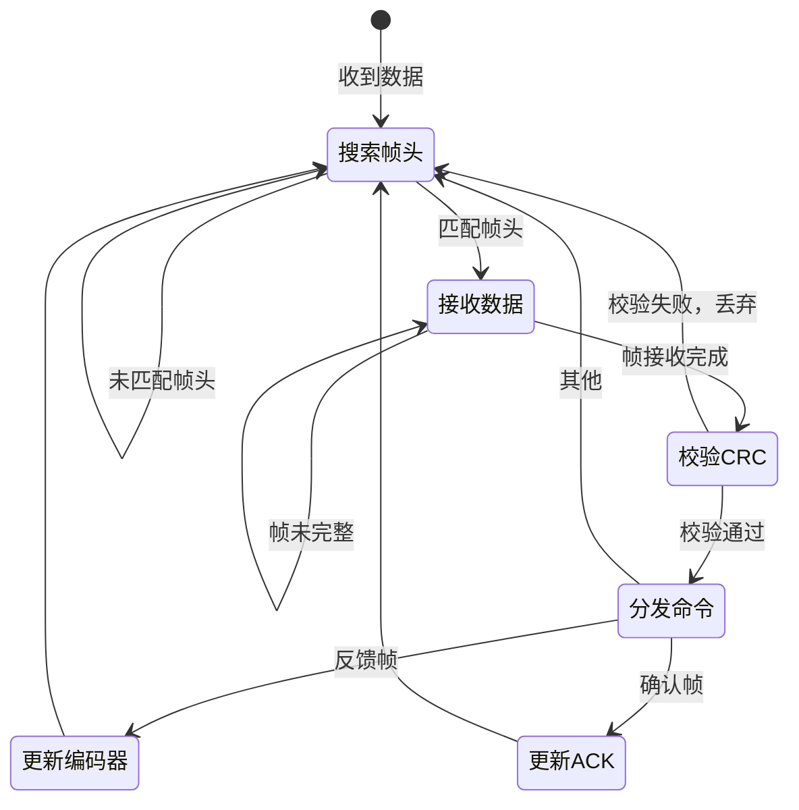
```mermaid
stateDiagram-v2
    [*] --> 搜索帧头: 收到数据
    
    搜索帧头 --> 搜索帧头: 未匹配帧头
    搜索帧头 --> 接收数据: 匹配帧头
    
    接收数据 --> 接收数据: 帧未完整
    接收数据 --> 校验CRC: 帧接收完成
    
    校验CRC --> 分发命令: 校验通过
    校验CRC --> 搜索帧头: 校验失败，丢弃
    
    分发命令 --> 更新编码器: 反馈帧
    分发命令 --> 更新ACK: 确认帧
    分发命令 --> 搜索帧头: 其他
    
    更新编码器 --> 搜索帧头
    更新ACK --> 搜索帧头
```

**图 6-2：帧接收状态机**

接收线程的状态机包含四个状态：**搜索帧头**为初始状态，持续扫描缓冲区中的帧头标识 `0xAA55`，未匹配时丢弃无效字节；匹配帧头后转入**接收数据**状态，等待缓冲区累积满 39 字节；帧接收完成后进入**校验 CRC** 状态，使用 CRC16-Modbus 校验数据完整性，校验失败则丢弃整帧回到搜索帧头；校验通过后进入**分发命令**状态，根据命令字更新编码器值（`0xA1` 反馈帧）或 ACK 时间戳（`0x81` 确认帧），然后回到搜索帧头等待下一帧。该状态机自动处理字节边界对齐和帧头跨 read 边界的情况。

接收线程维护两个关键状态：`latest_encoder`（最新编码器反馈值）和 `last_ack_time`（最近一次 ACK 的时间戳）。主循环通过读取这些状态判断通信健康度。

## 6.4 ACK 超时与故障安全

通信可靠性是实时控制系统的生命线。为应对下位机意外断电、串口断开等异常情况，系统在后期完善阶段增加了多层故障安全机制。

### 6.4.1 ACK 超时检测

主循环每帧（约 20ms）检查当前时间与 `last_ack_time` 的差值。若超过 `ack_timeout_sec`（默认 0.8s）未收到 ACK，触发急停：

1. 发送急停帧 `pack_stop()` 通知下位机紧急停止
2. 将插值器锁定到当前位置，防止恢复通信后的意外跳动
3. 将发送线程切换到急停模式，停止发送正常数据
4. 立即更新 GUI 显示 "ACK TIMEOUT" 和 "EMERGENCY_STOP" 状态

### 6.4.2 自动退出机制

若通信中断持续超过 `ack_exit_delay`（默认 3.0s），系统自动退出主循环并进入清理流程：停止所有线程、关闭串口、关闭 GUI 窗口。该机制防止程序在通信丢失后永久挂起。

### 6.4.3 串口写超时保护

串口写操作设置了 `write_timeout`（默认 1.0s），防止下位机离线后 `serial.write()` 无限阻塞。同时，ACK 超时处的 `pack_stop()` 发送调用被 try-except 包裹，即使急停帧发送失败也能继续执行后续关闭流程。

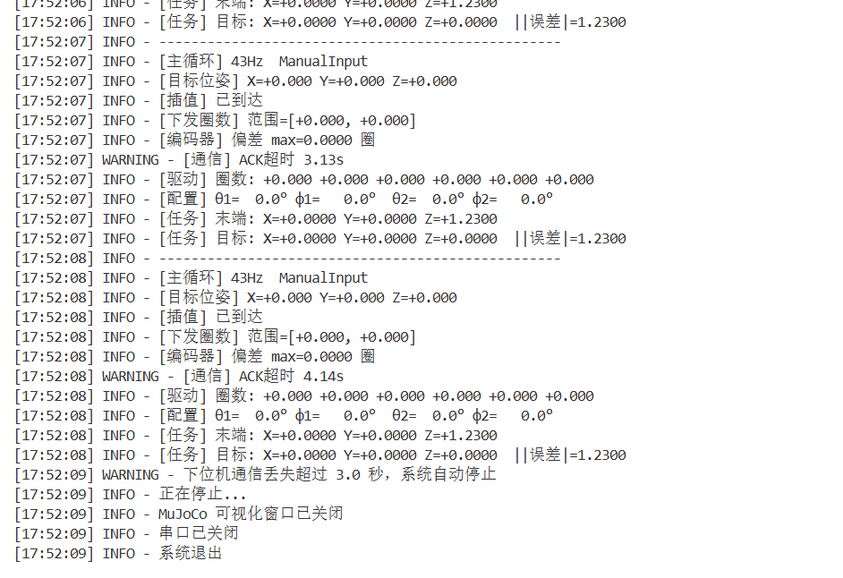

**图 6-3：下位机断联后上位机自动关闭** — 当下位机意外停止时，上位机检测到 ACK 超时，控制台和 GUI 同时显示通信丢失警告（"ACK TIMEOUT" 红色），并在 3 秒后自动停止。

---

# 7 输入源与控制模式

## 7.1 输入源架构

系统采用策略模式（Strategy Pattern）实现控制模式的切换。所有输入源继承自同一个抽象接口：

```
抽象类：InputSource
─────────────────────────────────────────────
方法 get_target():
    返回 [x, y, z] 目标位置 (m)，或 None（表示无新目标）

方法 get_direct_rotations():
    返回 (rotations, q, position) 直接驱动信号
    若不为 None，则跳过 IK 直接下发舵机圈数
    （用于圈数/绳长/曲率模式）

方法 start(), stop():
    生命周期管理（开启/释放摄像头等资源）
```

`get_target()` 返回笛卡尔目标，走正常 IK 管线。`get_direct_rotations()` 返回已计算好的舵机圈数，跳过 IK 和位置限幅，用于直接驱动模式。

## 7.2 手动模式 (ManualInput)

手动模式支持四种子模式：

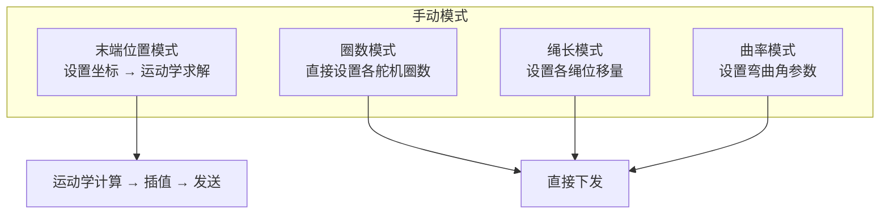
```mermaid
graph TD
    subgraph 手动模式
        EE["末端位置模式<br/>设置坐标 → 运动学求解"]
        RT["圈数模式<br/>直接设置各舵机圈数"]
        CL["绳长模式<br/>设置各绳位移量"]
        CV["曲率模式<br/>设置弯曲角参数"]
    end
    
    EE --> NF["运动学计算 → 插值 → 发送"]
    RT --> DF["直接下发"]
    CL --> DF
    CV --> DF
```

**图 7-1：手动模式子模式**

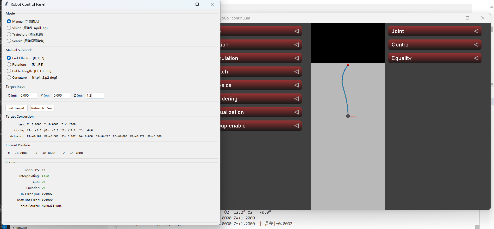

## 7.3 视觉伺服模式 (VisionInput)

视觉模式通过 AprilTag 检测获取目标位姿，实现闭环视觉伺服。

### 7.3.1 AprilTag 检测流程

```
算法：AprilTag 位姿估计
─────────────────────────────────────────────
输入：相机帧 frame
     已知 tag 物理尺寸 tag_size
     已知相机内参 camera_matrix, dist_coeffs
输出：tag 在机器人坐标系下的位置 [x, y, z]

  1. 初始化 AprilTag 检测器 (36h11 字典)
  2. 对输入帧执行 detectMarkers():
     返回 corners (4×2 像素坐标), ids, rejected
  3. 若未检测到任何 tag:
     返回 None
  4. 定义 3D 物体点:
     以 tag 中心为原点, 边长为 tag_size 的正方形四个角点
  5. 调用 solvePnP(object_points, corners, 
                    camera_matrix, dist_coeffs):
     返回 rvec (旋转向量), tvec (平移向量)
  6. 坐标变换:
     t_robot ← R_cam_to_robot @ t_cam + t_cam_to_robot
  7. 返回 [t_robot_x, t_robot_y, t_robot_z]
```

solvePnP 将标定所得的相机内参矩阵和畸变系数作为已知输入，从 2D-3D 对应点恢复 tag 的 6-DOF 位姿。第二步的坐标变换将 tag 在相机坐标系下的位置转换到机器人基坐标系，该变换矩阵当前为单位矩阵，有待后续手眼标定。

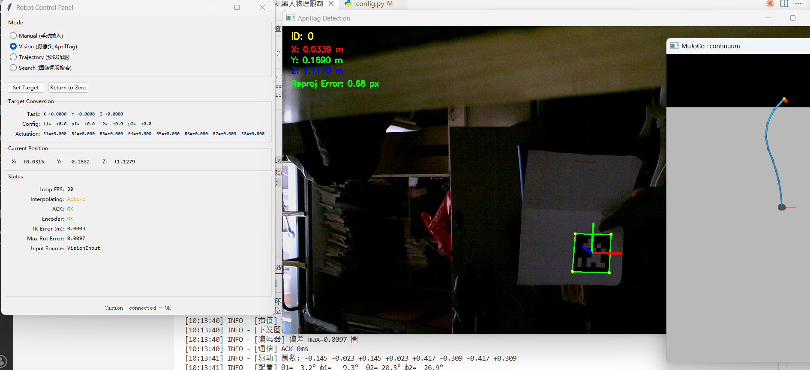

## 7.4 轨迹跟踪模式 (TrajectoryInput)

系统支持三种预设轨迹：

**正弦轨迹**：
$$
p_{\text{axis}}(t) = \text{center}_{\text{axis}} + A \cdot \sin(2\pi f t)
$$

**圆形轨迹**：
$$
\begin{aligned}
p_x(t) &= \text{center}_x + A \cdot \cos(2\pi f t) \\
p_y(t) &= \text{center}_y + A \cdot \sin(2\pi f t) \\
p_z(t) &= \text{center}_z
\end{aligned}
$$

**直线轨迹**：三角波往复运动，沿指定轴在 $\text{center} \pm A$ 之间匀速往返。

## 7.5 图像搜索模式 (SearchInput)

该模式实现了完整的"扫描-发现-跟踪"视觉伺服循环：

```
算法：图像搜索视觉伺服
─────────────────────────────────────────────
输入：相机帧 frame
全局状态：当前是否已锁定目标

  模式 A — 目标已锁定（伺服跟踪）:
    1. 检测 AprilTag
    2. 若未检测到 → 切换到"扫描"模式
    3. 计算像素误差:
       ex ← tag_center_x - 图像中心_x  (640)
       ey ← tag_center_y - 图像中心_y  (360)
       area_error ← target_area - actual_area
    4. 判断死区:
       if |ex| < 40px and |ey| < 40px and |area_error| < 15%:
           hold_counter++
           if hold_counter >= 15:     // 稳定锁定约 1.5s
              保持当前姿态, 返回 None
       else:
          hold_counter ← 0
    5. 计算控制量:
       theta1 ← Kp · sqrt(ex²+ey²) / cx    // 指向误差方向
       phi1   ← atan2(ey, ex)               // 弯曲平面
       theta2 ← -Ka · area_error            // 前后调整
    6. 限制角度、计算腱绳位移、返回舵机圈数

  模式 B — 目标丢失（螺旋扫描）:
    1. theta1 ← 0.04 (小角度锥形扫描)
    2. phi1 ← 2π · scan_speed · t          // 螺旋旋转
    3. theta2 ← 0
    4. 返回舵机圈数（驱动机器人扫描搜索）
```

该算法将视觉伺服分为两种模式：锁定模式使用比例控制（P 控制器）将 tag 引导至图像中心并调整前后距离，死区+滞回机制防止在目标附近抖动；扫描模式通过圆锥螺旋运动搜索丢失的 tag，实现自主恢复跟踪。

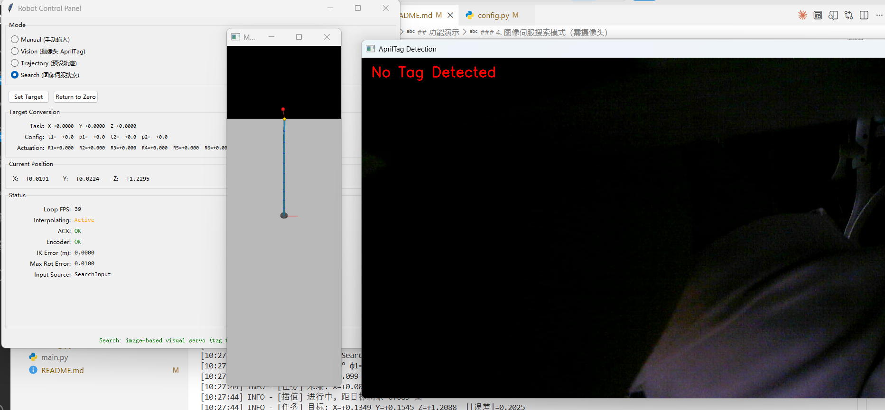

---

# 8 上位机实现

## 8.1 开发迭代历程

上位机控制系统并非一蹴而就，而是经历了一个从简到繁、逐步完善的六阶段迭代过程。每个阶段解决特定的核心问题，为下一阶段奠定基础。

### 阶段一：仅下位机（裸机调试）

在开发的初始阶段，只有 STM32 下位机固件和舵机驱动可用。上位机仅是一个**串口调试助手**——工程师手动输入 39 字节十六进制帧，通过串口发送给 STM32，观察舵机是否旋转到预期位置。此阶段验证了通信链路的最基本功能：帧能被下位机正确接收、CRC 校验通过、舵机响应指令。

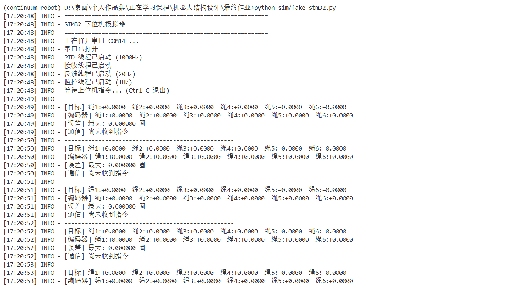

**图 8-1：下位机启动** — STM32 下位机上电启动后的控制台输出。启动信息显示固件版本、通信参数和初始化状态。从此阶段的串口输出可以确认下位机的 UART 接收线程和 PID 控制线程已正常启动。

此阶段暴露的问题：手动发送十六进制帧效率极低，无法进行连续轨迹控制；缺乏运动学计算能力，舵机圈数需要人工估算。

### 阶段二：添加上位机（运动学）

第二阶段的核心工作是将运动学模型从公式转化为可执行的 Python 代码。实现了 `robot/kinematics.py` 中的 `MultiSectionRobot` 类，涵盖正运动学、逆运动学、雅可比矩阵和腱绳映射。实现了一个简易的命令行控制循环（`main.py` 雏形），能够从终端读取目标坐标、运行 IK 计算、打包发送。

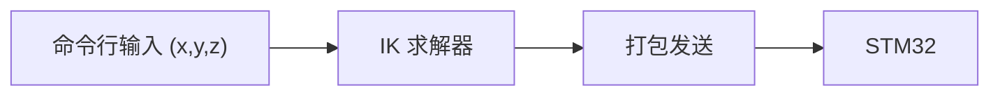
```mermaid
graph LR
    CL["命令行输入 (x,y,z)"] --> IK["IK 求解器"]
    IK --> PK["打包发送"]
    PK --> STM["STM32"]
```

此阶段验证了运动学模型的正确性和 IK 求解的实时性——单次 IK 求解约 12ms，满足 50Hz 控制循环需求。

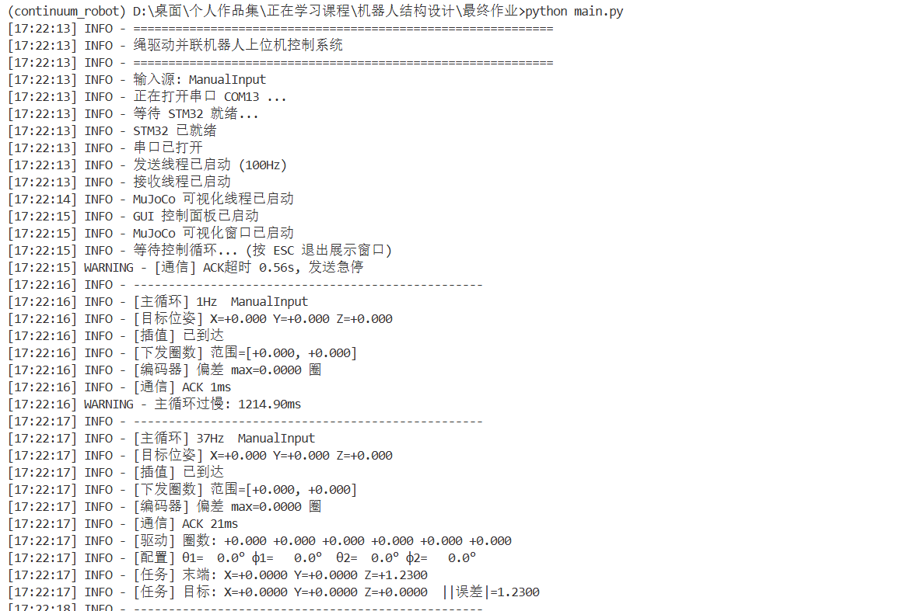

**图 8-2：上位机启动** — 上位机启动后的控制台界面。依次显示输入源类型、串口连接、各线程启动信息和控制循环日志。图中可看到 Ack 状态、发送频率和编码器反馈值，表明上下位机通信已建立。

### 阶段三：添加通信

在第二阶段，发送和接收在同一个循环中顺序执行（发送后阻塞等待回复）。这种方式在通信正常时工作良好，但一旦回复延迟会导致整个控制循环阻塞。为此，第三阶段引入了**多线程收发架构**：

- **发送线程**（`comm/sender.py`）以 100Hz 独立运行，与主循环解耦，确保下位机始终以稳定频率接收指令
- **接收线程**（`comm/receiver.py`）持续监控缓冲区，异步解析帧并更新状态
- **串口管理器**（`comm/serial_mgr.py`）封装线程锁，保证并发安全

通信协议被抽取为独立模块 `comm/protocol.py`，包含帧打包/解析、CRC16-Modbus 校验的 Python 和 C 双实现，确保上下位机交叉验证。

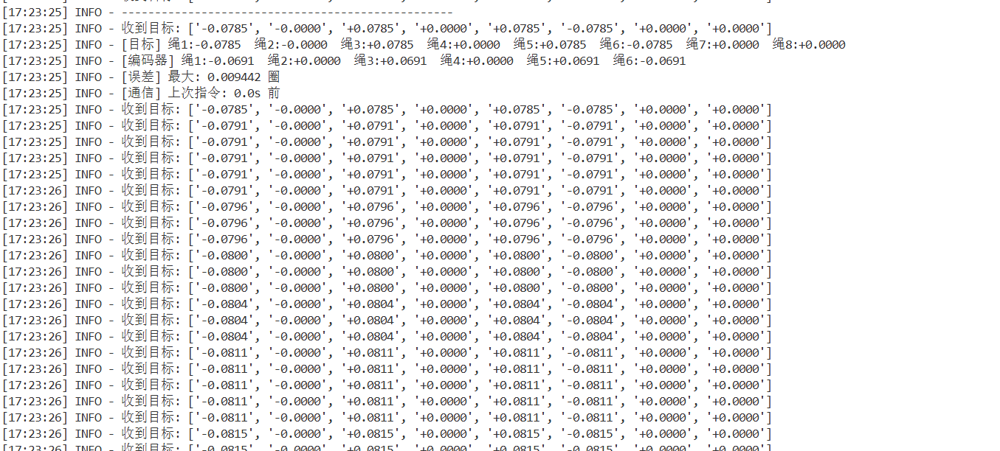

**图 8-3：下位机接收指令** — 下位机控制台显示收到上位机发送的目标圈数指令并回复 ACK 确认。每一行显示 6 根绳的目标圈数，下位机 PID 线程开始驱动模拟电机跟踪目标值。

### 阶段四：添加视觉

在上位机-下位机通信稳定的基础上，第四阶段引入视觉伺服能力。实现了两种视觉模式：

- **VisionInput**：固定眼在手外模式，通过 AprilTag 检测和 solvePnP 获取目标位姿，作为 IK 输入
- **SearchInput**：图像搜索伺服，实现螺旋扫描、视觉锁定、死区保持的完整闭环

视觉模块需要相机标定参数（阶段五详述），因此在实现视觉管道的同时，开发了 `camera_calibration_tool` 完成标定。

### 阶段五：添加 GUI

随着控制模式增多，纯命令行交互方式不再满足需求。第五阶段基于 tkinter 实现了图形化控制面板。GUI 运行在独立线程中，通过 `SharedState` 与主循环进行线程安全的数据交换。

```
主线程 (50Hz)          GUI 线程 (10Hz)
    │                       │
    │── set_pose() ────────→│  (主循环写入当前位置)
    │── set_status() ──────→│  (主循环写入系统状态)
    │←── get_target() ─────│  (GUI 读取用户输入)
    │←── stop_requested() ─│  (GUI 窗口关闭时通知)
```

GUI 面板包含：顶层模式切换（Manual/Vision/Trajectory/Search）、手动子模式选择及动态输入控件、三空间转换实时显示、当前位姿显示和系统状态指示（FPS/ACK/编码器/IK 误差）。

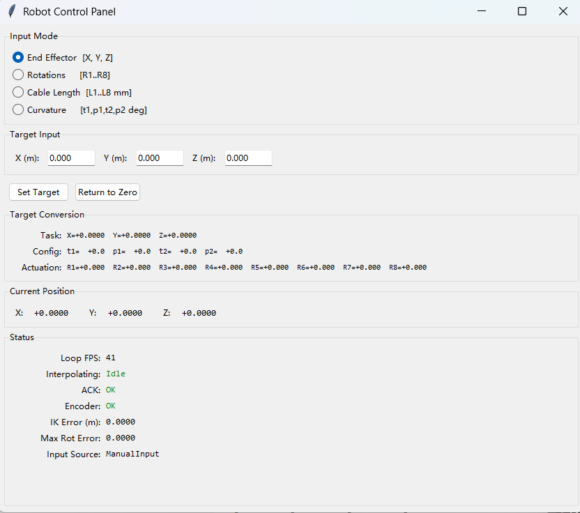

**图 8-4：GUI 控制面板** — 控制面板布局分为几个功能区：顶部为顶层模式选择（Manual / Vision / Trajectory / Search），中间为手动输入控件（此处为 End Effector XYZ 输入），下方为三空间转换显示（任务/构型/驱动空间），底部为当前位置和实时状态。

### 阶段六：完善通信和上位机

在系统联调过程中，发现了一个关键问题：当 STM32 意外断电或串口断开时，上位机程序没有任何反应，继续发送数据并显示"通信正常"。用户手动关闭时，Ctrl+C 也无法终止程序。

第六阶段针对这一"死而不僵"的问题进行了全面完善：

1. **ACK 超时检测**：主循环每帧检查 ACK 时间戳，超时后发送急停帧
2. **发送器急停模式**：发送线程切换到急停模式，持续发送急停指令
3. **自动退出机制**：超时持续 3 秒后自动关闭，防止永久挂起
4. **串口写超时**：设置 1 秒写超时，防止 serial.write() 无限阻塞
5. **Windows Ctrl+C 修复**：移除不兼容的 signal 自定义处理，使 Ctrl+C 正常生效

## 8.2 主控制循环

主循环以 50Hz 固定频率运行，每个周期内执行以下操作：

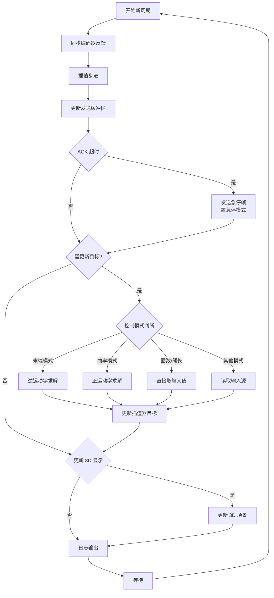
```mermaid
graph TD
    START[开始新周期] --> SYNC[同步编码器反馈]
    SYNC --> STEP[插值步进]
    STEP --> SEND[更新发送缓冲区]
    SEND --> ACK{ACK 超时}

    ACK -->|是| STOP[发送急停帧<br/>置急停模式]
    ACK -->|否| CHK_IK{需更新目标?}

    STOP --> CHK_IK
    CHK_IK -->|是| GUI_MODE{控制模式判断}
    CHK_IK -->|否| CHK_MJ{更新 3D 显示}

    GUI_MODE -->|末端模式| DO_IK[逆运动学求解]
    GUI_MODE -->|曲率模式| DO_FK[正运动学求解]
    GUI_MODE -->|圈数/绳长| DIRECT[直接取输入值]
    GUI_MODE -->|其他模式| READ_INPUT[读取输入源]

    DO_IK --> UPDATE[更新插值器目标]
    DO_FK --> UPDATE
    DIRECT --> UPDATE
    READ_INPUT --> UPDATE

    UPDATE --> CHK_MJ
    CHK_MJ -->|是| MJ[更新 3D 场景]
    CHK_MJ -->|否| LOG[日志输出]

    MJ --> LOG
    LOG --> SLEEP[等待]
    SLEEP --> START
```

**图 8-5：主控制循环流程图 (50Hz)**

控制循环的流程分为四个阶段。**阶段一（同步与发送）**：同步编码器反馈使插值器跟踪实际位置，步进插值器计算当前帧的输出圈数，更新发送缓冲区——这些操作每帧都会执行。**阶段二（安全性检查）**：检查 ACK 超时，若通信中断则发送急停帧并置急停模式。**阶段三（运动学更新，降频执行）**：根据当前控制模式（手动/视觉/轨迹/搜索），执行 IK/FK 求解或直接读取输入值，更新插值器目标。**阶段四（可视化与同步）**：更新 MuJoCo 3D 场景，每秒输出一次状态日志，然后休眠至下一周期开始。其中阶段三以主循环的降频因子（默认 5，即 10Hz）执行，其余阶段每帧（50Hz）执行。

## 8.3 GUI 控制面板

GUI 基于 tkinter 实现，运行在独立线程中，通过 `SharedState` 与主循环通信。支持 Manual、Vision、Trajectory、Search 四种顶层模式，每种模式切换时动态重建输入控件。实时状态显示区以 10Hz 更新 FPS、插值状态、ACK 状态、编码器状态、IK 误差等运行参数。控制面板布局已在图 8-4 中展示。

## 8.4 MuJoCo 3D 可视化

MuJoCo 场景完全由程序化几何体构建，不依赖于 XML 模型文件。视觉渲染逻辑为：根据构型参数 $q$ 计算机器人骨架节点位置，绘制蓝色球体作为节点、青色胶囊体作为连杆，绘制黄色球体作为末端执行器，绘制红色球体作为目标点并用虚线连接表示跟踪误差，最后绘制 RGB 坐标轴指示基座标系方向（红色箭头指向 X 正方向即绳 3 方向，绿色箭头指向 Y 正方向即绳 2 方向，蓝色箭头指向 Z 正方向即竖直向上，坐标轴原点位于机器人基座中心）。

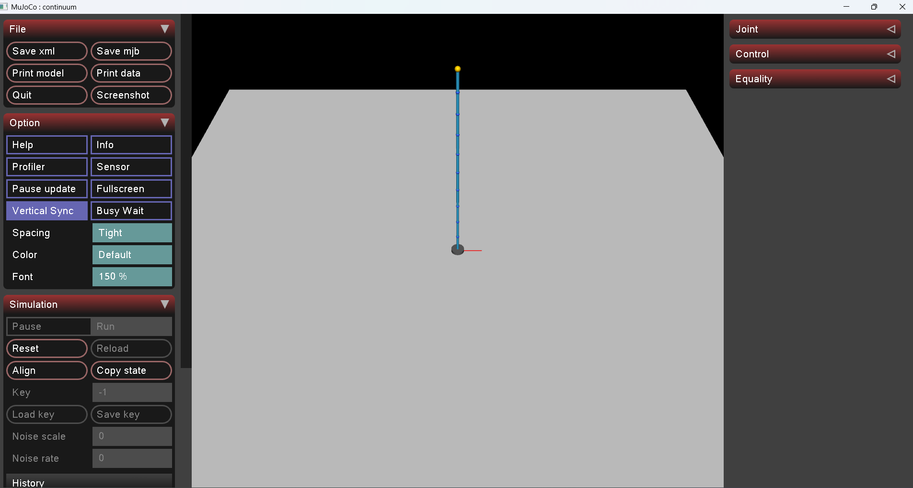

**图 8-5：MuJoCo 仿真初始位置** — 机器人处于竖直向上（零位）状态。蓝色球体为各子节节点，青色连杆表示结构骨架，末端黄色球体为执行器。底部 RGB 坐标轴指示机器人基座标系方向。MuJoCo 场景以约 17Hz 更新，实时反映当前状态。

## 8.5 SharedState 数据桥

`SharedState` 是 GUI 线程与主控制循环之间的线程安全数据交换中心。所有读写方法均用 `threading.Lock` 保护。其设计遵循"一次消费"原则：GUI 写入的状态变更（如模式切换、目标更新）被主循环 consume 一次后清空，避免重复处理；主循环写入的状态（如当前位置、系统状态）被 GUI 定时 poll 读取。该设计避免了多线程共享内存中的竞态条件和数据不一致问题。

---

# 9 实验与验证

## 9.1 运动学精度测试

### 9.1.1 FK/IK 往返验证

测试方法：随机生成构型参数 $q$，通过 FK 计算末端位置 $\mathbf{p}$，再通过 IK 从 $\mathbf{p}$ 反算 $\hat{q}$，比较末端位置误差。

测试配置为：随机范围 $\theta \in [5^\circ, 45^\circ]$, $\phi \in [0^\circ, 360^\circ]$；IK 最大迭代 80 次；IK 求解容差 $10^{-4}$ m，验收容差 $2 \times 10^{-3}$ m（超出则拒绝下发）。

**结果**：100 次随机测试中 IK 成功率 100%，末端位置误差 $< 2 \times 10^{-3}$ m（满足验收容差），单次求解时间约 12ms。

### 9.1.2 协议打包往返验证

将 IK 输出的舵机圈数打包为帧，通过 `pack_target()` → `parse_frame()` 往返，验证数据一致性：

```
测试结果:
  帧长度: 39 字节 (符合协议规范)
  帧头: aa55 (正确)
  帧尾: 0d0a (正确)
  CRC校验: 通过
  最大数据差异: < 1e-5 (float32 精度范围内)
```

## 9.2 全流程仿真验证

仿真模式将 IK 输出送入 `tendon_to_config()` 逆映射，通过 FK 得到实际末端位置，并计算三空间误差：

| 指标 | IK 理论误差 | 实际跟踪误差 | 第一段追踪误差 |
|------|------------|------------|--------------|
| 典型值 (m) | $9 \times 10^{-6}$ | $2 \times 10^{-3}$ | $2 \times 10^{-3}$ |

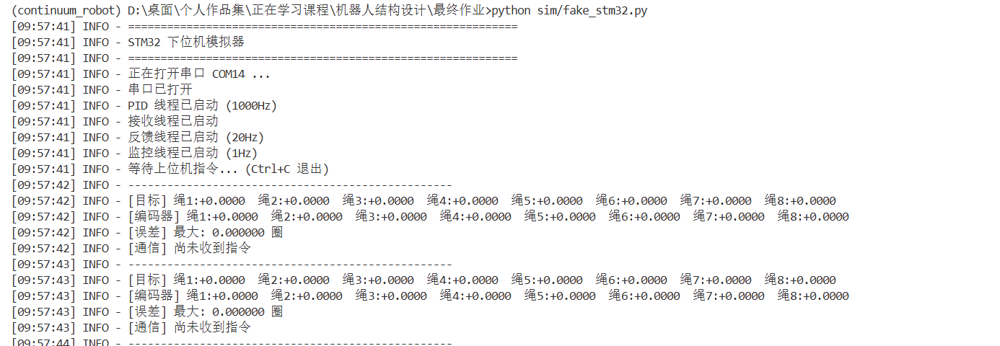

**图 9-1：下位机模拟器运行状态** — fake_stm32.py 模拟器的运行输出。图中可见 1Hz 状态监控（目标值、编码器值、跟踪误差），以及"超过 1s 未收到上位机指令"的通信警告。模拟器验证了上下位机通信闭环的完整性。

## 9.3 CRC 校验测试

通过 XOR 翻转数据字节验证 CRC 的篡改检测能力：

```
测试帧 CRC: 0x1B5D
篡改后 CRC: 0x2C4E (与原始值不同)
[通过] CRC 篡改检测正常
```

## 9.4 数值稳定性验证

100 次随机目标的舵机圈数统计：

| 指标 | 值 |
|------|-----|
| 最大圈数 | 1.05 圈 |
| 圈数量级 | << 10 (适合 float32 传输) |
| float32 精度 | $\sim 1 \times 10^{-6}$ |

## 9.5 实物调试

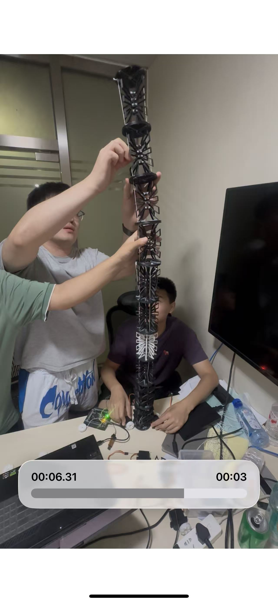

**图 9-2：实物联合调试** — 仅实物样机照片。由于时间原因，实物调试阶段只控制了上边两根绳，实现了一定程度的弯曲，验证了运动学算法在实际硬件上实现的可能性。底座未打印完整，因此无法同时控制多路舵机来验证完整视觉弯曲效果。

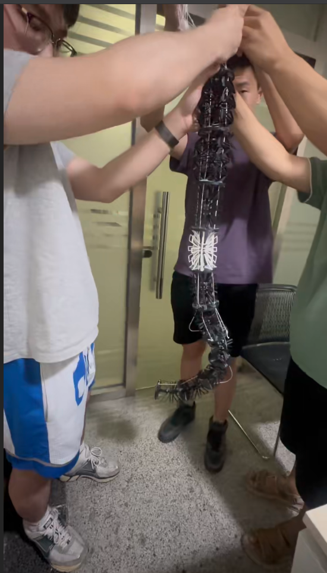

**图 9-3：实物运行图** — 手动拖拽绳子，模拟舵机驱动效果，验证了机械结构本身的可行性和模块化刚度设计在弯曲时的表现。

系统正在进行实物样机调试。当前已完成上位机控制软件、通信协议和运动学求解器的仿真验证，下位机 STM32 固件和舵机驱动部分正在联调中。

---

# 10 结论

## 10.1 核心成果

本文设计并实现了一套完整的绳驱动连续体机器人上位机控制系统。主要成果包括：实现了从目标位置输入到舵机指令下发的**完整控制管线**，涵盖运动学求解、运动插值、串口通信、安全监控等环节；采用阻尼最小二乘法结合多目标优化，实现了**高精度逆运动学求解**，仿真精度在 2mm 以内，单次求解耗时约 12ms，满足 50Hz 控制循环要求；**多模式控制**支持手动、视觉伺服、轨迹跟踪和图像搜索四种控制模式，覆盖了从基础调试到自主作业的多种使用场景；开发了 STM32 下位机模拟器和 MuJoCo 3D 可视化的**完善仿真环境**，支持无硬件全流程调试；通过配置参数即可切换 4+4 和 4+2 两种腱绳布局的**可切换腱绳配置**，适应不同的硬件实现条件（因时间限制，实物样机最终以 4+2 配置实现）；基于棋盘格标定工具完成了**相机内参标定**，为视觉伺服提供硬件基础；在后期完善阶段增加了**ACK 超时急停与自动退出**等故障安全机制，提升了系统可靠性；经历了从裸机调试到完整系统的**六阶段迭代开发**，每个阶段有明确的目标和验收标准。

## 10.2 创新之处

本项目的创新之处主要体现在三个方面。其一，针对多段连续体机器人的欠驱动配置，推导了**2 绳段 PCC 运动学模型**的完整正/逆运动学映射（实物样机因时间限制第二段仅保留 2 绳拮抗对），在降低硬件复杂度的同时保留了弯曲角和弯曲平面的控制能力。其二，准确建模了第二段腱绳穿过第一段产生的**耦合位移**，并通过数值雅可比将其纳入 IK 优化框架。其三，实现了"螺旋扫描-视觉锁定-死区保持"的完整**图像搜索伺服**循环，使机器人在目标丢失后能自主搜索并重新锁定。

## 10.3 不足与展望

当前工作仍存在若干不足有待改进。在**运动学模型**方面，PCC 模型假设常曲率圆弧，忽略了腱绳柔顺性、摩擦等非理想因素，实际样机可能存在偏差，未来可引入基于学习的补偿方法。在**视觉标定**方面，相机-机器人坐标变换目前为单位矩阵，需要在实际部署前完成手眼标定。在**轨迹优化**方面，当前 IK 求解未考虑弯曲角速度/角加速度约束，运动平滑性仅依赖插值器，未来可引入轨迹规划层生成动力学可行的平滑轨迹。在**实时性验证**方面，当前验证在仿真环境中完成，实际硬件上的实时性和稳定性需要通过实验进一步验证。在**下位机固件**方面，STM32 的 PID 控制和编码器读取功能为仿真模式，实际硬件还需完成舵机驱动和传感器接口调试。在**硬件实现**方面，受限于时间，原本规划的 8 路（4+4）绳驱动最终以 6 路（4+2）配置实现，第二段仅保留 0° 和 180° 两个方位的拮抗对，弯曲平面角 $\phi_2$ 失去独立控制能力，未来可恢复全配置以获得完整自由度。

---

# 参考文献

1. Webster R J, Jones B A. Design and kinematic modeling of constant curvature continuum robots: A review[J]. The International Journal of Robotics Research, 2010, 29(13): 1661-1683.

2. Olson E. AprilTag: A robust and flexible visual fiducial system[C]. 2011 IEEE International Conference on Robotics and Automation, 2011: 3400-3407.

3. Siciliano B, Sciavicco L, Villani L, et al. Robotics: Modelling, Planning and Control[M]. Springer, 2009.

4. Murray R M, Li Z, Sastry S S. A Mathematical Introduction to Robotic Manipulation[M]. CRC Press, 1994.

5. Todorov E, Erez T, Tassa Y. MuJoCo: A physics engine for model-based control[C]. 2012 IEEE/RSJ International Conference on Intelligent Robots and Systems, 2012: 5026-5033.

6. Modbus. MODBUS over Serial Line Specification and Implementation Guide V1.02[S]. Modbus Organization, 2006.

7. Bradski G. The OpenCV Library[J]. Dr. Dobb's Journal of Software Tools, 2000.

8. Jones B A, Walker I D. Kinematics for multisection continuum robots[J]. IEEE Transactions on Robotics, 2006, 22(1): 43-55.

9. Camarillo D B, Carlson C R, Salisbury J K. Configuration tracking for continuum manipulators with coupled tendon drive[J]. IEEE Transactions on Robotics, 2009, 25(4): 798-808.

10. 杨明星, 彭博浩, 张兴, 等. 一种绳驱刚柔耦合连续体机器人结构设计与运动学分析[J/OL]. 机械科学与技术. DOI:10.13433/j.cnki.1003-8728.20250130.

11. Dewi P T, Rao P, Burgner-Kahrs J. A lightweight modular segment design for tendon-driven continuum robots with pre-programmed stiffness[C]. 2024 7th IEEE International Conference on Soft Robotics (RoboSoft). San Diego, CA: IEEE, 2024.

12. 刘宇航, 吕剑青, 罗凯. 数据驱动修正的连续体机械臂运动学建模与控制[J/OL]. 北京理工大学学报. https://link.cnki.net/urlid/11.2596.T.20260511.1342.002.

13. 张声. 绳驱蛇形机器人的动力学建模与滑模控制研究[D]. 鞍山: 辽宁科技大学, 2025.

14. Zhang Z. A flexible new technique for camera calibration[J]. IEEE Transactions on Pattern Analysis and Machine Intelligence, 2000, 22(11): 1330-1334.

---

# 致谢

感谢"机器人结构设计"课程提供的实践机会，感谢指导教师在选题、方案设计和调试过程中给予的耐心指导。

感谢组员在项目中的通力协作：张孟智负责机械结构设计与 Abaqus 有限元分析校核，为机器人的结构强度和安全性提供了量化依据；周展生负责张紧装置的专门设计与验证，为控制系统能够作用于物理样机提供了机械前提；感谢两位在系统联调过程中的配合与支持。

感谢实验室同学在系统联调过程中的帮助与支持。
